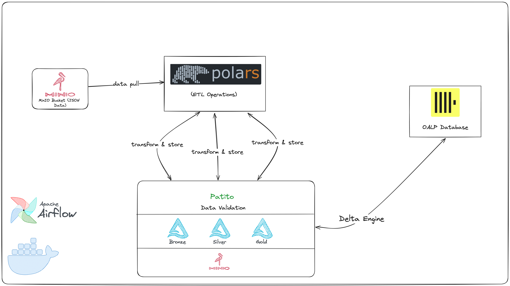

# POLARS ETL PIPELINE

**Data Pipeline Architecture Documentation**
 <p align="center">
    
   </a>
</p>

<!-- TOC -->
* [POLARS ETL PIPELINE](#polars-etl-pipeline)
  * [Overview](#overview)
  * [Architecture Explanation](#architecture-explanation)
    * [Data Ingestion](#data-ingestion)
    * [Data Processing](#data-processing)
    * [Data Storage and Querying](#data-storage-and-querying)
    * [Metadata Management](#metadata-management)
    * [Key Features and Benefits](#key-features-and-benefits)
  * [Data Processing Detail](#data-processing-detail)
    * [Log Data and Multi-hop Architecture](#log-data-and-multi-hop-architecture)
    * [Data validation](#data-validation)
  * [Reproducing pipeline](#reproducing-pipeline)
  * [Note](#note)
    * [On Polars](#on-polars)
    * [On Metastore](#on-metastore)
    * [On Clickhouse](#on-clickhouse)
<!-- TOC -->

## Overview

This document provides a comprehensive overview of the data pipeline architecture, designed to ingest, process, and
deliver data for a variety of analytical workloads.
The pipeline leverages industry-leading technologies to ensure high performance, scalability, reliability, and
flexibility, enabling insightful data-driven decision-making.

## Architecture Explanation

### Data Ingestion

* JSON log files are initially stored in MinIO S3-compatible object-storage.
* Log data will be ingested by Polars and later be processed further.

### Data Processing

There is two different types of pipeline, `polars_dag.py` and `polars_dag_delta.py`. All of them are orchestrated by
Airflow.

For `polars_dag.py`, the pipeline is described as follows:

* Data will be read directly from **Minio-S3** into in-memory **LazyFrame** using **Polars**
* ETL operations is done using **Polars**, which is orchestrated by Airflow using **DockerOperator** to get rid of
  dependencies
  management in Airflow containers.
* Intermediate result will be validated by Patito which is a small OSS data validation package made purely for Polars.
* Serving result is also stored in DeltaLake and later on be ingested to Clickhouse using **ClickhouseOperator**

For `polars_dag_delta.py`, the pipeline is described as follows:

* Data will be read directly from **Minio-S3** into in-memory **LazyFrame** using **Polars** and transforms to
  **DeltaLake** format and done Compaction and Z-Ordering. Compaction and Z-Ordering can increase the performance of
  later ETL operations.
* ETL operations is done using **Polars**, which is orchestrated by **Airflow** using **TaskFlow API** to get rid of
  dependencies.
* Serving result is also stored in DeltaLake and later on be ingested to Clickhouse using **ClickhouseOperator**


### Data Storage and Querying

Processed data in Delta Lake format is accessible to multiple query engines for diverse analytical needs:

* **ClickHouse**: Serves as OALP database, load Delta Lake tables directly from MinIO using native **Delta Engine** of
  Clickhouse, enables real-time analytics and low-latency queries.

### Metadata Management

_Left to be written out later_

### Key Features and Benefits

* **Scalability**: The pipeline architecture supports seamless growth and accommodates increasing data volumes.
* **Performance**: StarRocks and ClickHouse deliver exceptional query performance, empowering timely insights.
* **Reliability**: Delta Lake guarantees data integrity and resilience to failures, ensuring data trustworthiness.
* **Flexibility**: The pipeline supports multiple query engines, catering to diverse analytical requirements.
* **Manageability**: Hive Metastore simplifies metadata management, streamlining data governance and administration.

## Data Processing Detail

### Log Data and Multi-hop Architecture

The raw data used in this project is logging data tracking user behaviour of a telecom company in one month of 2023 and
stored in S3-compatible object storage (MinIO).
This data is processed following **medallion architecture** (multi-hop architecture) which logically organize data in
lakehouse, with the goal
of incrementally and progressively improving
the structure and quality of data as it flows through each layer of the architecture (from **Bronze (Raw Integration)**
-> **Silver (Filter, Cleaned, Augmented)**
-> **Gold (Business-Level aggregates)**).

1. **Bronze layer**: This layer stores data from upstream sources as is. Since data is stored initially in nested JSON
   format, it needs to be unpacked in wide-column format table.
    ```
   Bronze layer schema
    |-- Index: string (nullable = true)
    |-- Type: string (nullable = true)
    |-- Id: string (nullable = true)
    |-- Score: long (nullable = true)
    |-- AppName: string (nullable = true)
    |-- Contract: string (nullable = true)
    |-- Mac: string (nullable = true)
    |-- TotalDuration: long (nullable = true)
    |-- Date: date (nullable = true)
   ```

2. **Silver layer**: Data from bronze layer is transformed in custom logic which is analyzing the user behaviours in a
   month following requirements, for instance:
    * How much time does the customers spend on watching several types of channel?
    * Which is the most watching categories with respect to each customer?

   ```
   Silver layer schema
    |-- Contract: string (nullable = true)
    |-- TVDuration: long (nullable = true)
    |-- ChildDuration: long (nullable = true)
    |-- MovieDuration: long (nullable = true)
    |-- RelaxDuration: long (nullable = true)
    |-- SportDuration: long (nullable = true)
    |-- MostWatch: string (nullable = true)

   ```
3. **Gold layer**: Data from silver layer and bronze are combined to form datasets that directly map to the end-user use
   case.
    * Based Customer360 principles, segmenting the customers into different categories using **RFM analysis**

    ```
       Gold layer schema
        |-- Contract: string (nullable = true)
        |-- TVDuration: long (nullable = true)
        |-- ChildDuration: long (nullable = true)
        |-- MovieDuration: long (nullable = true)
        |-- RelaxDuration: long (nullable = true)
        |-- SportDuration: long (nullable = true)
        |-- MostWatch: string (nullable = true)
        |-- RFM: string (nullable = true)
    ```

Log data is available upon request, please contact the repository owner.

### Data validation

When building a pipeline, it is critical to ensure the quality of input and output data. If downstream consumers use bad
data, it can be disastrous.

To prevent such nightmare, validation method is implemented using **Patito** to validate data before publishing
it. This process usually involves the time-consuming and expensive re-running
of all the affected processes since validation requires cluster computer to re-loading and counting on datasets.
Thankfully, **Patito** has a cache mechanism to reducing such processes.

## Reproducing pipeline

First, reader can clone this project with Git. A Makefile is included to simplify the reproducing steps.

```bash
make up #run the docker container, this takes a few minutes at first run
make start #start the pipeline 
make down #shut down the container after finishing 
```

## Note

### On Polars

**Polars** is defined as a query engine with emphasize on DataFrame API. One of the most superior features that makes 
Polars surpasses Pandas is **lazy execution** meaning that the query is only evaluated once it is _called_. Almost all
the code in pipeline of this project utilizes the **LazyFrame API**, which will put less stress on CPU and memory thus
allowing pipeline to fit in large dataset, for instance, one month of logging data is around 10GB. 

However, readers may wonder why not using Spark since Spark also has lazy execution. The main reason is that Polars 
requires less configuration on a cluster compared to Spark, which allows practitioners to spend more time on ad-hoc 
query. 

### On Metastore

**Spark** has two ways to store the metadata. The first one is storing metadata in built-in **Apache Derby** RDBMS but
this option does not support multiple SparkSession at a time. The second one is **Hive Metastore** which allows multiple
session concurrently. **Hive Metastore** also acts as a centralized metadata store for other service **enabling
composable lakehouse**.

On the other hands, **Polars** does not have the concept of metastore. Metastore or Catalog can be deployed through
**Delta-RS** which has two available options (**Glue** and **Unity**). Moreover, if one want to equip a query engine on
top of DeltaLake, they must use Glue or Unity Catalog or create a catalog from filesystems which is supported by
**Trino/Presto/Starrocks/Doris**

### On Clickhouse

Instead of pushing data from MinIO to Clickhouse using Clickhouse-Spark connector, this project will rely on the native
ingesting engine which is Delta Engine from Clickhouse. 

> **_Why not directly sinking result to Clickhouse_?**
>
> Although Clickhouse supports inserting data in Arrow Format, there is no obvious way to get data from Polars in-memory
> LazyFrame/DataFrame to Clickhouse (as far as I know). The solution here is storing result in DeltaLake and let using
> DeltaEngine of Clickhouse
> to insert it into database.

### On Airflow
This project uses Airflow with the support of Astro CLI. Astro CLI makes Airflow usage less complicated. For more 
information on Astro CLI, please refer to Astronomer's homepage.


